# Creating Virtual UbuntuMail:

Download: **[Ubuntu-Mail .ova file](https://mayorsec-my.sharepoint.com/personal/joe_mayorsec_com/_layouts/15/onedrive.aspx?ga=1&id=%2Fpersonal%2Fjoe%5Fmayorsec%5Fcom%2FDocuments%2FCourse%20Share%20Drive%2FNet1%20%2D%20UbuntuMail%2Eova&parent=%2Fpersonal%2Fjoe%5Fmayorsec%5Fcom%2FDocuments%2FCourse%20Share%20Drive)**

To open the OVF file, simply right-click on it and choose "Open with VirtualBox Manager."

To optimize performance, reduce the CPU allocation to 1 processor and set the RAM to 2GB. Once adjusted, proceed by clicking the "Import" button.

Navigate to the "Settings" menu and select "Network." On the "Adapter 1" tab, configure the following settings, then click "OK" to apply the changes.

To begin using UbuntuMail, launch the application. When you encounter the login screen, enter the following credentials to log in:
Username: studentuser
Password: Password123!.

After logging into UbuntuMail, you can check the network settings 

Click on the gear icon in the corner of the screen. 

If the DNS settings are not already configured as described earlier, take the following steps:

- Click on the "IPv4" tab.
- Enter "8.8.8.8" in the DNS option.
- Press the "Apply" button to save the new DNS configuration.

To ensure that the new configuration is applied, turn the connection off and on. After doing so, close the settings window to complete the process.

To verify if the network is functioning correctly, access the RoundCube webmail server from one of the domain workstations using the following address:

`https://<ubuntuIP>/mail`

Replace `<ubuntuIP>` with the actual IP address of the UbuntuMail server. 

Great news! All the required lab devices have been generated successfully.

### OR

-  **Steps to create a virtual machine:**
> **Download Ubuntu: https://ubuntu.com/download/desktop**

- Open Virtual Box.

- Click on create a new virtual machine.

- Follow the prompts to name your virtual machine and choose the desired operating system.

- Allocate the desired amount of RAM for the virtual machine.

- Specify the size and location of the virtual hard disk.
   
- Start the virtual machine and proceed with the installation of the chosen operating system.

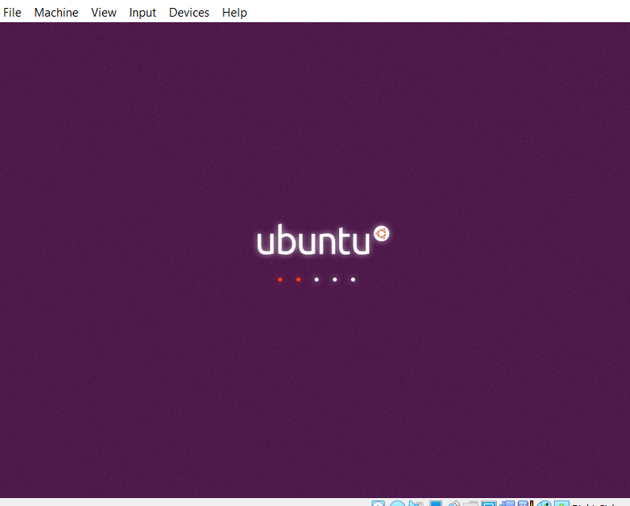

Select the "Install Ubuntu" option from the installation menu. Please note that the exact wording may vary slightly depending on the specific version or edition of Ubuntu you are using.

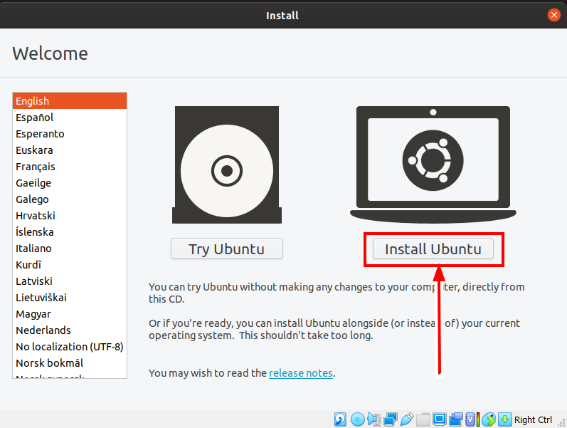

Proceed with the default keyboard layout selection. If the defaults are compatible with your keyboard, simply click on the "Continue" button to proceed with the installation process.

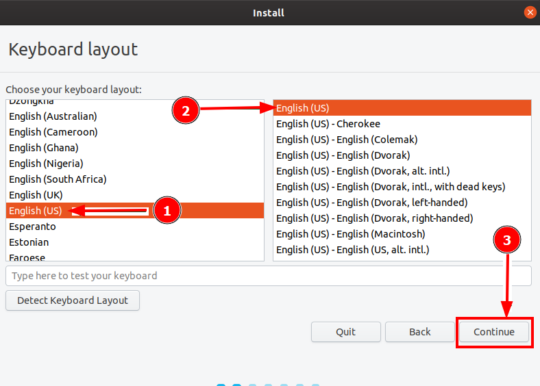

By default, the installation type is set to "Normal installation," which is the recommended option. 

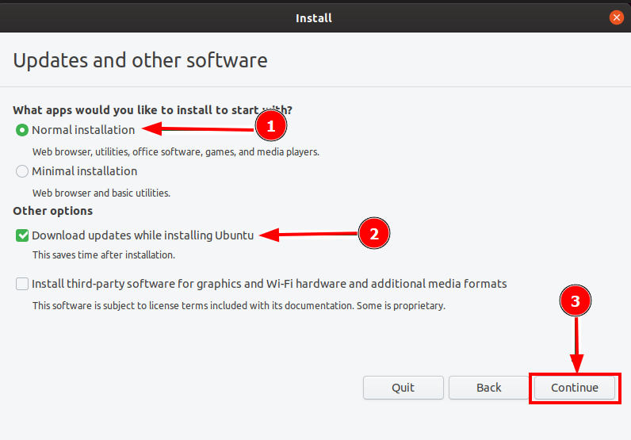

Click on the "Install Now" button to initiate the installation process. Please note that the "Erase disk" option will only affect the virtual machine's disk within VirtualBox, and it will not impact any system files or data outside of the virtual environment. You can proceed with the installation without concern for your host system's files.

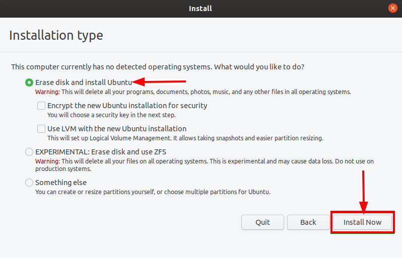

Click on the "Continue" button to proceed with the installation process. You will be prompted to confirm and write the changes to the disk. This step is necessary to initiate the installation of Ubuntu on the virtual machine's disk.

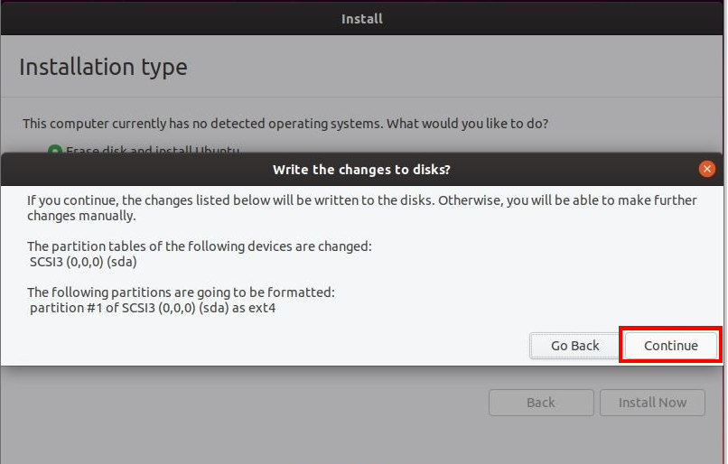

Select your location from the options provided to set the correct time zone for your virtual machine. 

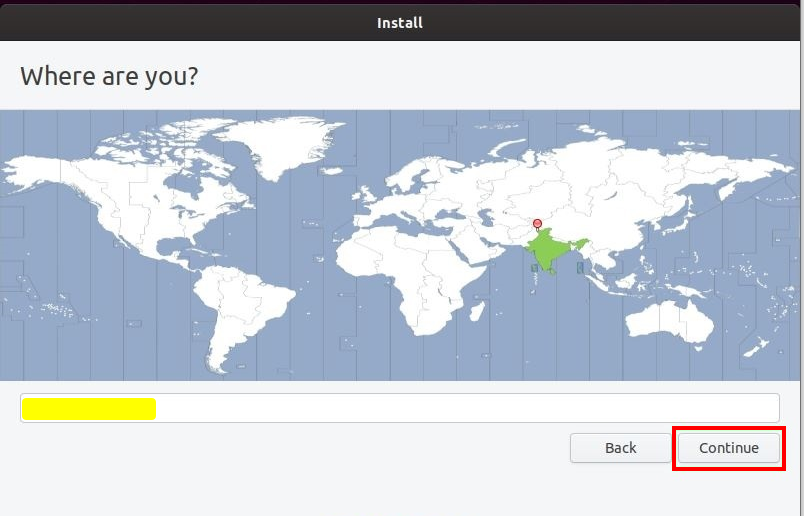

Choose a name for your computer and set a password to secure login info.

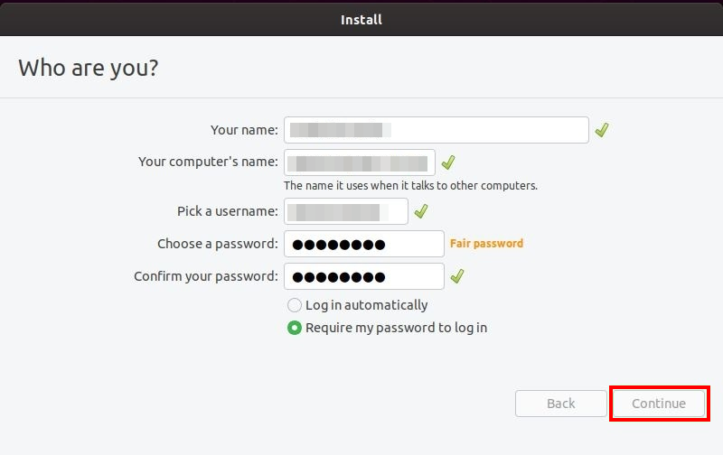

Please wait patiently for the installation process to complete. The duration of the installation may vary depending on the system specifications and the selected installation options.

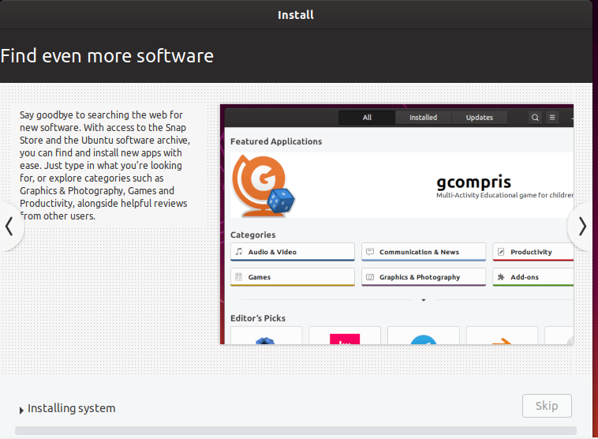

After the installation process is complete, it is recommended to reboot your virtual machine. Rebooting will finalize the installation and ensure that all the necessary configurations are applied.

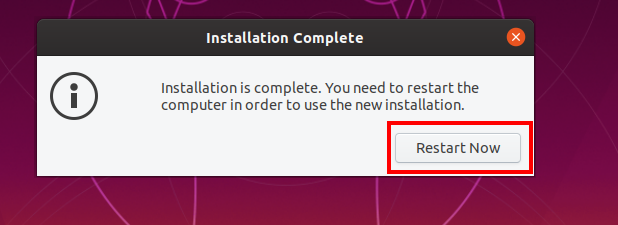

Congratulations! You have successfully completed the installation process for Ubuntu as a virtual machine.

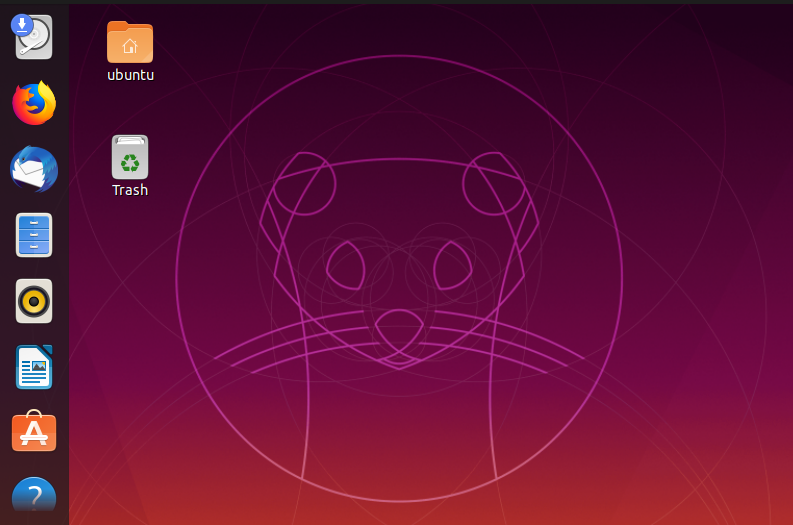

# Network Settings:

 Configure network settings for the "ubuntumail" virtual machine, follow these steps:

1. Select the "ubuntumail" virtual machine.
    
2. Click on "Settings" to access the VM settings.
   
3. Navigate to the "Network" section.
    
4. Under "Adapter 1," choose "NAT Network" from the dropdown menu.
    
5. Select the name "External" from the available options.

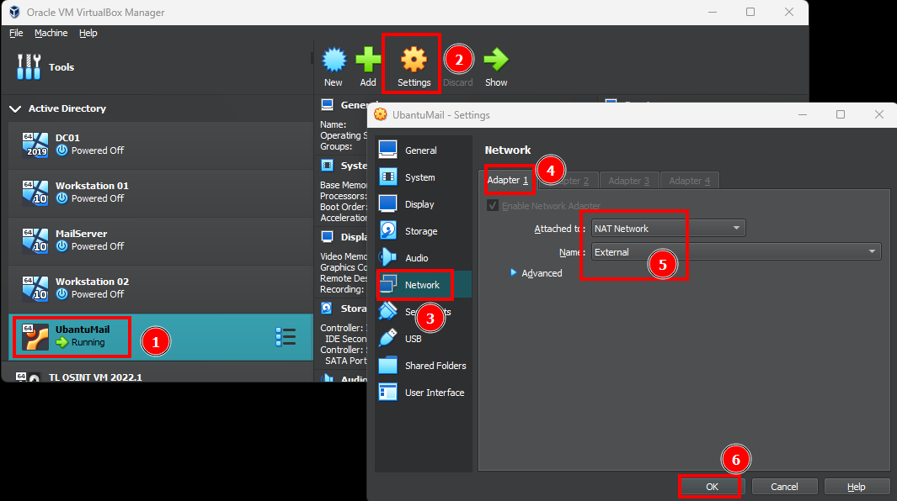

# Configure Network Adapter:

Click on "Settings" > "Wired Connect" > "Wired settings"

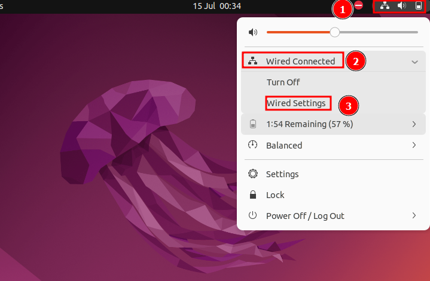

Click "Setting" icon.

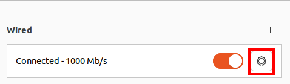

In the network settings, locate and click on "IPv4". Then, disable the automatic DNS configuration and manually enter the DNS address as "8.8.8.8", Click Apply.

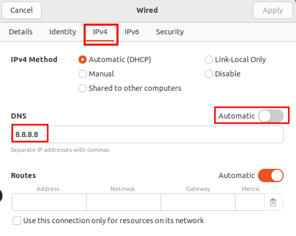

Please make sure that your network settings match the configuration displayed in the provided image. While the IPv4 address may vary, ensure that the highlighted settings remain the same. Click Apply.

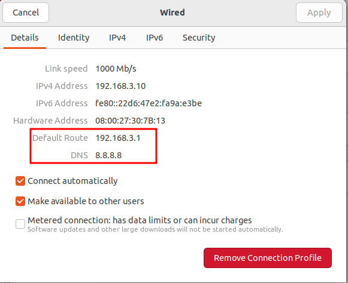

 Disable and then re-enable the wired connection.
 
Open the terminal application on your Ubuntu virtual machine and enter the command "ping google.com". This command will initiate a ping request to the Google website and display the response time and connectivity status between your virtual machine and the Google server.

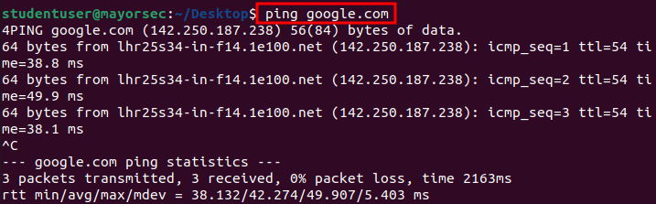

Configured network settings, and performed additional steps to ensure connectivity.

Reference: [Article for setting up UbuntuMail](https://tecadmin.net/how-to-install-roundcube-webmail-on-ubuntu-20-04/)
