# Creating network

Whole in Virtual Box, hold ctrl+h to launch 'Network Manager'. Alternatively, click on **File > Tools > Network Manager**.

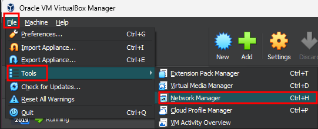

Then Click on the "NAT Networks" tab.

To create the "external" network, click on the green icon with the "+" sign.

    Name: External
    CIDR: 192.168.3.0/24
    Enable the network by checking the checkbox.

Repeat the same process to create the "internal" network:

    Name: Internal
    CIDR: 192.168.16.0/24
    Enable the network by checking the checkbox.

Finally, create the "secure" network:

    Name: Secure
    CIDR: 192.168.116.0/24
    Enable the network by checking the checkbox.

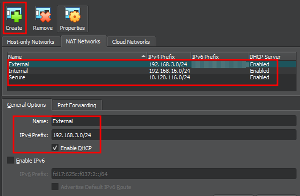

# Creating Virtual Domain:

### Server 2019 ISO Download: https://www.microsoft.com/en-us/evalcenter/evaluate-windows-server-2019

This segment is designed to assist beginners in creating Windows virtual machines in a straightforward manner. If you already have experience with this process, you can skip ahead to.

- Click on **New** icon


- Name your virtual machine. Select the type and version of the operating system you want to set up.

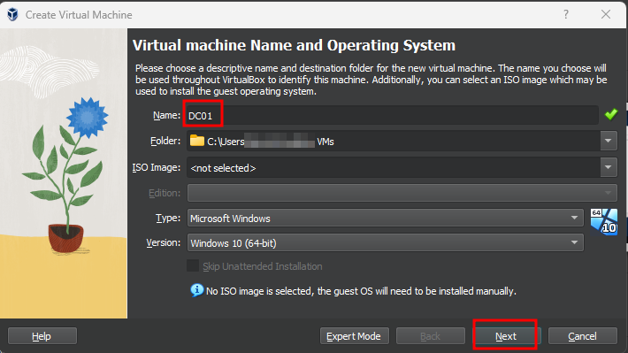

- Assign the desired amount of RAM for the virtual machine. If your system has limited resources, it is advisable to allocate 2GB of RAM for a swift Windows installation.

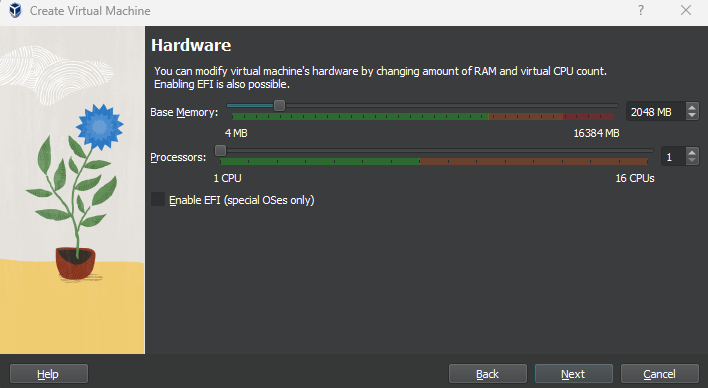

- In this final step, you will allocate the size of the hard disk that the virtual machine will use. In this case, it is recommended to assign a disk size of 50GB for each virtual machine.

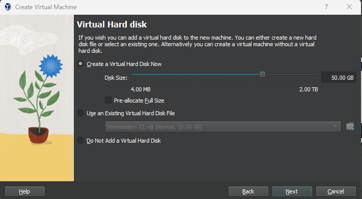


To select the ISO disc file for your virtual machine, go to the virtualization software interface and locate the created virtual machine named DC01. Access its settings, navigate to the Storage section, and click on the blue disc icon to select the ISO file. Choose the desired ISO file from your system's storage. This will associate the ISO disc file with your virtual machine, allowing you to install or boot from the selected ISO image.

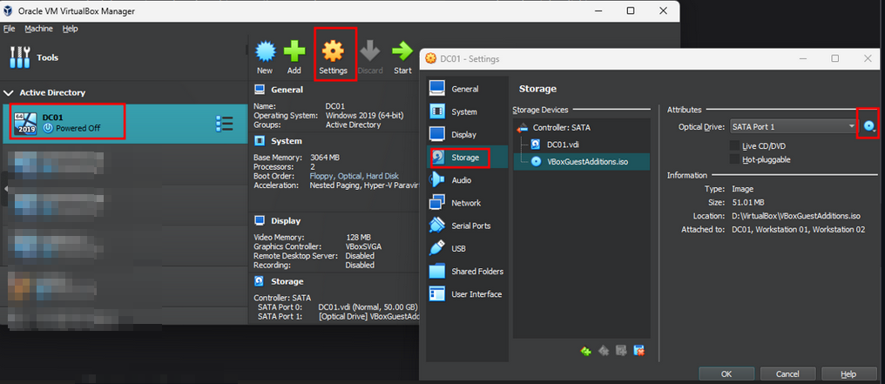

# DC Installation:

- Boot the Windows Server virtual machine that you have set up. During the boot process, you will encounter the End-User License Agreement (EULA). Accept the EULA to proceed with the installation process

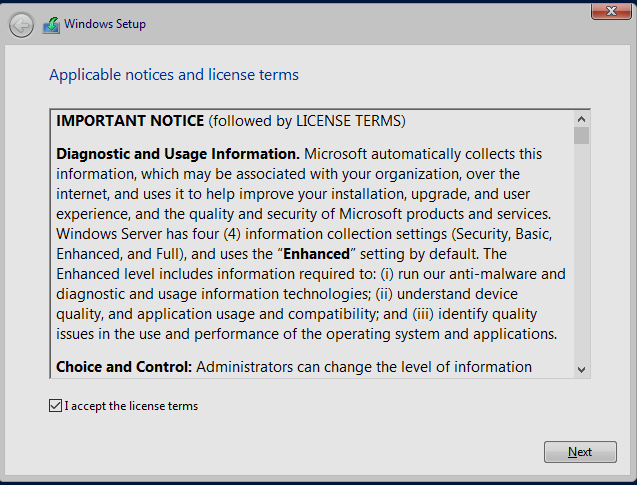

- During the installation process, select the "Custom: Install Windows only (advanced)" option. This will provide you with advanced customization options for installing Windows on your virtual machine.

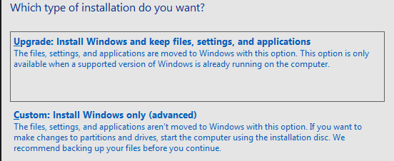

- Select the appropriate drive where you want to install Windows and click on the "Next" button to proceed with the installation process.

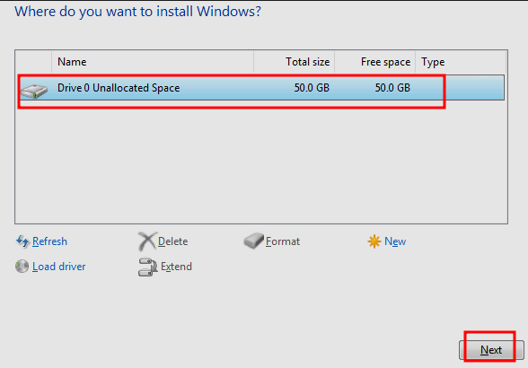

- After completing the previous step, the installation process will start. Once it's done, you will be asked to create an Administrator password. For this lab exercise, it's suggested to set a strong password like "Password123!" for better security. Enter the password and click "Next" to continue.

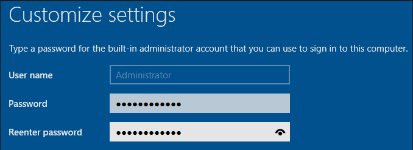

- Once you successfully log in, you will be greeted with the Server Manager Dashboard.

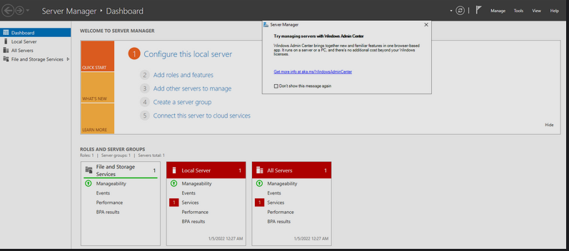

# Setting Up DC:

For the purpose of this course, instead of manually setting up the Domain Controller, we can utilize a collection of PowerShell scripts developed by [TheMayor/Joe Helle](https://twitter.com/i/flow/login?redirect_after_login=%2Fjoehelle). These scripts will create a vulnerable environment that allows us to practice penetration testing and gain insights into various concepts. You can download the scripts from the following GitHub repository: [dievus/ADGenerator](https://github.com/dievus/ADGenerator). Simply follow the instructions provided in the repository to proceed with the setup.

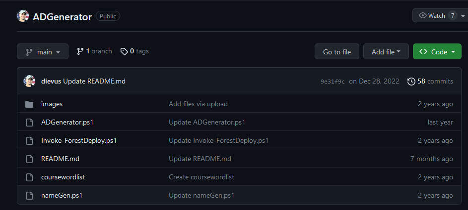

- To begin the setup process, the first script you need to execute is "Invoke-ForestDeploy.ps1".
> _By running the "Invoke-ForestDeploy.ps1" script, you will install the Windows Active Directory Domain Services toolset and generate the domain. Pay close attention to the on-screen instructions and make note of the domain name used during the setup, as it will be required later on. It's crucial to be aware that the scripts are specifically designed for the "mayorsec.local" domain name. Using a different domain name may result in the "ADGenerator.ps1" script not functioning properly._

```powershell
PS C:\Users\Administrator\Desktop\ADGenerator-main> dir


    Directory: C:\Users\Administrator\Desktop\ADGenerator-main


Mode                LastWriteTime         Length Name
----                -------------         ------ ----
d-----         14/7/2023  12:17 AM                images
-a----         14/7/2023  12:17 AM          18405 ADGenerator.ps1
-a----         14/7/2023  12:17 AM           2034 coursewordlist
-a----         14/7/2023  12:17 AM           1912 Invoke-ForestDeploy.ps1
-a----         14/7/2023  12:17 AM            951 nameGen.ps1
-a----         14/7/2023  12:17 AM           1902 README.md


PS C:\Users\Administrator\Desktop\ADGenerator-main> Set-ExecutionPolicy Unrestricted

Execution Policy Change
The execution policy helps protect you from scripts that you do not trust. Changing the execution policy might expose you to the security risks described in the about_Execution_Policies help topic at
https:/go.microsoft.com/fwlink/?LinkID=135170. Do you want to change the execution policy?
[Y] Yes  [A] Yes to All  [N] No  [L] No to All  [S] Suspend  [?] Help (default is "N"): Y
PS C:\Users\Administrator\Desktop\ADGenerator-main> . .\Invoke-ForestDeploy.ps1

Security warning
Run only scripts that you trust. While scripts from the internet can be useful, this script can potentially harm your computer. If you trust this script, use the Unblock-File cmdlet to allow the script to run without this warning
message. Do you want to run C:\Users\Administrator\Desktop\ADGenerator-main\Invoke-ForestDeploy.ps1?
[D] Do not run  [R] Run once  [S] Suspend  [?] Help (default is "D"): R
PS C:\Users\Administrator\Desktop\ADGenerator-main> Invoke-ForestDeploy -DomainName mayorsec.local

             ______                     __        ____             __
            / ____/___  ________  _____/ /_      / __ \___  ____  / /___  __  __
           / /_  / __ \/ ___/ _ \/ ___/ __/_____/ / / / _ \/ __ \/ / __ \/ / / /
          / __/ / /_/ / /  /  __(__  ) /_/_____/ /_/ /  __/ /_/ / / /_/ / /_/ /
         /_/    \____/_/   \___/____/\__/     /_____/\___/ .___/_/\____/\__, /
                                                        /_/            /____/
        Domain Deployment Script by TheMayor

        [*] Installing Windows AD Domain Services Toolset. [*]

Success Restart Needed Exit Code      Feature Result
------- -------------- ---------      --------------
True    No             Success        {Active Directory Domain Services, Group P...


Toolset installed.


        [*] Generating the domain. Make note of the domain name for the ADGenerator Script to be ran after the controller is built. [*]
SafeModeAdministratorPassword: ************
Confirm SafeModeAdministratorPassword: ************

The target server will be configured as a domain controller and restarted when this operation is complete.
Do you want to continue with this operation?
[Y] Yes  [A] Yes to All  [N] No  [L] No to All  [S] Suspend  [?] Help (default is "Y"): Y
WARNING: Windows Server 2019 domain controllers have a default for the security setting named "Allow cryptography algorithms compatible with Windows NT 4.0" that prevents weaker cryptography algorithms when establishing security channel
 sessions.

For more information about this setting, see Knowledge Base article 942564 (http://go.microsoft.com/fwlink/?LinkId=104751).

WARNING: This computer has at least one physical network adapter that does not have static IP address(es) assigned to its IP Properties. If both IPv4 and IPv6 are enabled for a network adapter, both IPv4 and IPv6 static IP addresses
should be assigned to both IPv4 and IPv6 Properties of the physical network adapter. Such static IP address(es) assignment should be done to all the physical network adapters for reliable Domain Name System (DNS) operation.

WARNING: A delegation for this DNS server cannot be created because the authoritative parent zone cannot be found or it does not run Windows DNS server. If you are integrating with an existing DNS infrastructure, you should manually
create a delegation to this DNS server in the parent zone to ensure reliable name resolution from outside the domain "mayorsec.local". Otherwise, no action is required.

WARNING: Windows Server 2019 domain controllers have a default for the security setting named "Allow cryptography algorithms compatible with Windows NT 4.0" that prevents weaker cryptography algorithms when establishing security channel
 sessions.

For more information about this setting, see Knowledge Base article 942564 (http://go.microsoft.com/fwlink/?LinkId=104751).

WARNING: This computer has at least one physical network adapter that does not have static IP address(es) assigned to its IP Properties. If both IPv4 and IPv6 are enabled for a network adapter, both IPv4 and IPv6 static IP addresses
should be assigned to both IPv4 and IPv6 Properties of the physical network adapter. Such static IP address(es) assignment should be done to all the physical network adapters for reliable Domain Name System (DNS) operation.

WARNING: A delegation for this DNS server cannot be created because the authoritative parent zone cannot be found or it does not run Windows DNS server. If you are integrating with an existing DNS infrastructure, you should manually
create a delegation to this DNS server in the parent zone to ensure reliable name resolution from outside the domain "mayorsec.local". Otherwise, no action is required.


Message        : Operation completed successfully
Context        : DCPromo.General.3
RebootRequired : False
Status         : Success


Restart the controller if not instructed.
```

*_Please note that there might be warning messages during the process, but you can disregard them. After the server restarts, you will observe that you are already operating within a domain named "mayorsec."_*

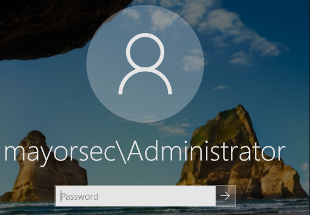

- The next step involves running the ADGenerator script. Similar to the previous step, you'll need to set the execution policy to "Unrestricted" and invoke the ADGenerator script. Ensure that you run it with the "DomainName" parameter set to "mayorsec.local".

- The ADGenerator script performs the following actions relevant to the course:

    - Generates groups for Senior Management, IT Admins, Engineering, and Sales.
    - Configures domain information.
    - Renames the domain controller to DC01.
    - Creates a shared folder named "Shared."
    - Creates users and assigns them to appropriate groups.
    - Allows WinRM TCP 5985 communication to domain-joined systems.
    - Configures GPO policies to enable PowerShell remoting on hosts.
    - Creates ACL misconfigurations, Kerberoastable service, administrative privilege delegation, and modifies ASREP settings.

```powershell
PS C:\Users\Administrator\Desktop\ADGenerator-main> dir


    Directory: C:\Users\Administrator\Desktop\ADGenerator-main


Mode                LastWriteTime         Length Name
----                -------------         ------ ----
d-----         14/7/2023  12:17 AM                images
-a----         14/7/2023  12:17 AM          18405 ADGenerator.ps1
-a----         14/7/2023  12:17 AM           2034 coursewordlist
-a----         14/7/2023  12:17 AM           1912 Invoke-ForestDeploy.ps1
-a----         14/7/2023  12:17 AM            951 nameGen.ps1
-a----         14/7/2023  12:17 AM           1902 README.md


PS C:\Users\Administrator\Desktop\ADGenerator-main> Set-ExecutionPolicy Unrestricted

Execution Policy Change
The execution policy helps protect you from scripts that you do not trust. Changing the execution policy might expose you to the security risks described in the about_Execution_Policies help topic at
https:/go.microsoft.com/fwlink/?LinkID=135170. Do you want to change the execution policy?
[Y] Yes  [A] Yes to All  [N] No  [L] No to All  [S] Suspend  [?] Help (default is "N"): Y
PS C:\Users\Administrator\Desktop\ADGenerator-main> . .\ADGenerator.ps1

Security warning
Run only scripts that you trust. While scripts from the internet can be useful, this script can potentially harm your computer. If you trust this script, use the Unblock-File cmdlet to allow the script to run without this warning
message. Do you want to run C:\Users\Administrator\Desktop\ADGenerator-main\ADGenerator.ps1?
[D] Do not run  [R] Run once  [S] Suspend  [?] Help (default is "D"): R
PS C:\Users\Administrator\Desktop\ADGenerator-main> Invoke-ADGenerator -DomainName mayorsec.local

            ___    ____     ______                           __
           /   |  / __ \   / ____/__  ____  ___  _________ _/ /_____  _____
          / /| | / / / /  / / __/ _ \/ __ \/ _ \/ ___/ __ `/ __/ __ \/ ___/
         / ___ |/ /_/ /  / /_/ /  __/ / / /  __/ /  / /_/ / /_/ /_/ / /
        /_/  |_/_____/   \____/\___/_/ /_/\___/_/   \__,_/\__/\____/_/
        Vulnerable Active Directory Domain Generator by The Mayor

        [*] Promoting Administrator to appropriate Domain Administrative roles required for the course. [*]
        [+] Promoting Administrator to Enterprise Administrator.
User Administrator is already a member of group Enterprise Admins.

More help is available by typing NET HELPMSG 3754.

        [+] Promoting Administrator to Domain Administrator.
User Administrator is already a member of group Domain Admins.

More help is available by typing NET HELPMSG 3754.

        [+] Promoting Administrator to Group Policy Creator Owners.
User Administrator is already a member of group Group Policy Creator Owners.

More help is available by typing NET HELPMSG 3754.

        [+] Promoting Administrator to Local Administrator (error output may occur - this is expected).
System error 1378 has occurred.

The specified account name is already a member of the group.

        [*] Administrative privilege delegation completed. [*]
        [*] Renaming the domain controller to DC01 [*]
WARNING: The changes will take effect after you restart the computer WIN-SOKFK09IVBB.


    Directory: C:\


Mode                LastWriteTime         Length Name
----                -------------         ------ ----
d-----         14/7/2023   2:05 AM                Shared

AvailabilityType      : NonClustered
CachingMode           : Manual
CATimeout             : 0
ConcurrentUserLimit   : 0
ContinuouslyAvailable : False
CurrentUsers          : 0
Description           :
EncryptData           : False
FolderEnumerationMode : Unrestricted
IdentityRemoting      : False
Infrastructure        : False
LeasingMode           : Full
Name                  : Shared
Path                  : C:\Shared
Scoped                : False
ScopeName             : *
SecurityDescriptor    : O:SYG:SYD:(A;;0x1200a9;;;BU)
ShadowCopy            : False
ShareState            : Online
ShareType             : FileSystemDirectory
SmbInstance           : Default
Special               : False
Temporary             : False
Volume                : \\?\Volume{8bba7c49-0000-0000-0000-602200000000}\
PSComputerName        :
PresetPathAcl         : System.Security.AccessControl.DirectorySecurity

        [*] Domain controller renamed. [*]
        [*] Creating Domain Groups [*]
                [+] Adding Senior Management to mayorsec.local
        [+] Adding IT Admins to mayorsec.local
        [+] Adding Engineering to mayorsec.local
        [+] Adding Sales to mayorsec.local
        [*] Generating Organizational Units for the mayorsec.local. [*]
        [+] Organizational Units added.
        [*] Group creation completed. [*]
        [*] Creating Domain Users [*]
        [+] a.adams added
        [+] Adding a.adams to Senior Management Group
        [+] Adding a.adams to Domain Administrators Group
        [+] j.taylor added
        [+] Adding j.taylor to IT Admins Group
        [+] j.anthony added
        [+] Adding j.anthony to Engineering Group
        [+] t.carter added
        [+] Adding t.carter to Engineering Group
        [+] m.phillips added
        [+] Adding m.phillips to Engineering Group
        [+] r.smith added
        [+] Adding r.smith to Engineering Group
        [+] s.chisholm added
        [+] Adding s.chisholm to Sales
        [+] m.seitz added
        [+] Adding m.seitz to Engineering Group
        [+] a.tarolli added
        [+] Adding a.tarolli to Sales
        [+] z.dickens added
        [+] Adding z.dickens to Sales
        [*] User creation completed [*]
        [*] Modifying pre-authentication privileges [*]
        [+] ASREP privileges granted to a.tarolli
        [*] ASREP settings update completed. [*]
        [*] Adding Kerberoastable service account to domain [*]
The command completed successfully.

Checking domain DC=mayorsec,DC=local

Registering ServicePrincipalNames for CN=mssql_svc,CN=Users,DC=mayorsec,DC=local
        DC01/mssql_svc.
Updated object
        [+] mssql_svc service account added
        [*] Kerberoastable service creation completed. [*]
        [*] Granting IT Admins GenericAll rights on Domain Admins. [*]
        [+] IT Admins group granted GenericAll permissions for the Domain Admins group.
        [*] Adding misconfigured ACL rule for the Engineering group. [*]
        [+] Whoops! GenericAll rights granted to Engineering.
        [*] Adding misconfigured ACL rule for Margaret Seitz. [*]
        [+] Whoops! GenericAll rights granted to m.seitz.
        [*] Adding misconfigured ACL rule for the Sales group. [*]
        [+] Whoops! GenericAll rights granted to Sales.
        [*] ACL misconfigurations completed. [*]
        [*] Configuring some GPO policies required for the domain. [*]

DisplayName   : WinRM Firewall TCP 5985
GpoId         : fac02e0a-d68e-4d10-979b-16a5f9db31ef
Enabled       : True
Enforced      : False
Order         : 2
Target        : DC=mayorsec,DC=local
GpoDomainName : mayorsec.local


Caption                 :
Description             :
ElementName             : Allow WinRM TCP 5985 To Domain Joined Systems
InstanceID              : {1fe11ce5-117b-48a1-bf7b-116c874d20e9}
CommonName              :
PolicyKeywords          :
Enabled                 : True
PolicyDecisionStrategy  : 2
PolicyRoles             :
ConditionListType       : 3
CreationClassName       : MSFT|FW|FirewallRule|{1fe11ce5-117b-48a1-bf7b-116c874d20e9}
ExecutionStrategy       : 2
Mandatory               :
PolicyRuleName          :
Priority                :
RuleUsage               :
SequencedActions        : 3
SystemCreationClassName :
SystemName              :
Action                  : Allow
Direction               : Inbound
DisplayGroup            :
DisplayName             : Allow WinRM TCP 5985 To Domain Joined Systems
EdgeTraversalPolicy     : Block
EnforcementStatus       : NotApplicable
LocalOnlyMapping        : False
LooseSourceMapping      : False
Owner                   :
Platforms               : {}
PolicyStoreSource       :
PolicyStoreSourceType   : GroupPolicy
PrimaryStatus           : OK
Profiles                : 0
RuleGroup               :
Status                  : The rule was parsed successfully from the store. (65536)
StatusCode              : 65536
PSComputerName          :
Name                    : {1fe11ce5-117b-48a1-bf7b-116c874d20e9}
ID                      : {1fe11ce5-117b-48a1-bf7b-116c874d20e9}
Group                   :
Profile                 : Any
Platform                : {}
LSM                     : False

        [+] A GPO for PowerShell Remoting was created for authenticated users on the domain.
        [*] GPO configurations completed. [*]
        [*] Configuring GPO policies to enable PowerShell remoting on hosts. [*]

DisplayName   : Enable PSRemoting Desktops
GpoId         : 6bc94864-cd95-44ea-9459-e050214175ad
Enabled       : True
Enforced      : False
Order         : 3
Target        : DC=mayorsec,DC=local
GpoDomainName : mayorsec.local


Id               : 6bc94864-cd95-44ea-9459-e050214175ad
DisplayName      : Enable PSRemoting Desktops
Path             : cn={6BC94864-CD95-44EA-9459-E050214175AD},cn=policies,cn=system,DC=mayorsec,DC=local
Owner            : mayorsec\Domain Admins
DomainName       : mayorsec.local
CreationTime     : 14/7/2023 2:32:43 AM
ModificationTime : 14/7/2023 2:32:44 AM
User             : Microsoft.GroupPolicy.UserConfiguration
Computer         : Microsoft.GroupPolicy.ComputerConfiguration
GpoStatus        : AllSettingsEnabled
WmiFilter        :
Description      :


Id               : 6bc94864-cd95-44ea-9459-e050214175ad
DisplayName      : Enable PSRemoting Desktops
Path             : cn={6BC94864-CD95-44EA-9459-E050214175AD},cn=policies,cn=system,DC=mayorsec,DC=local
Owner            : mayorsec\Domain Admins
DomainName       : mayorsec.local
CreationTime     : 14/7/2023 2:32:43 AM
ModificationTime : 14/7/2023 2:32:44 AM
User             : Microsoft.GroupPolicy.UserConfiguration
Computer         : Microsoft.GroupPolicy.ComputerConfiguration
GpoStatus        : AllSettingsEnabled
WmiFilter        :
Description      :


Id               : 6bc94864-cd95-44ea-9459-e050214175ad
DisplayName      : Enable PSRemoting Desktops
Path             : cn={6BC94864-CD95-44EA-9459-E050214175AD},cn=policies,cn=system,DC=mayorsec,DC=local
Owner            : mayorsec\Domain Admins
DomainName       : mayorsec.local
CreationTime     : 14/7/2023 2:32:43 AM
ModificationTime : 14/7/2023 2:32:44 AM
User             : Microsoft.GroupPolicy.UserConfiguration
Computer         : Microsoft.GroupPolicy.ComputerConfiguration
GpoStatus        : AllSettingsEnabled
WmiFilter        :
Description      :

        [+] Registry setting for Powershell Remoting OK!

Id               : 6bc94864-cd95-44ea-9459-e050214175ad
DisplayName      : Enable PSRemoting Desktops
Path             : cn={6BC94864-CD95-44EA-9459-E050214175AD},cn=policies,cn=system,DC=mayorsec,DC=local
Owner            : mayorsec\Domain Admins
DomainName       : mayorsec.local
CreationTime     : 14/7/2023 2:32:43 AM
ModificationTime : 14/7/2023 2:32:44 AM
User             : Microsoft.GroupPolicy.UserConfiguration
Computer         : Microsoft.GroupPolicy.ComputerConfiguration
GpoStatus        : AllSettingsEnabled
WmiFilter        :
Description      :


Id               : 6bc94864-cd95-44ea-9459-e050214175ad
DisplayName      : Enable PSRemoting Desktops
Path             : cn={6BC94864-CD95-44EA-9459-E050214175AD},cn=policies,cn=system,DC=mayorsec,DC=local
Owner            : mayorsec\Domain Admins
DomainName       : mayorsec.local
CreationTime     : 14/7/2023 2:32:43 AM
ModificationTime : 14/7/2023 2:32:46 AM
User             : Microsoft.GroupPolicy.UserConfiguration
Computer         : Microsoft.GroupPolicy.ComputerConfiguration
GpoStatus        : AllSettingsEnabled
WmiFilter        :
Description      :

        [+] Service setting for Powershell Remoting OK!
        [*] Domain-wide PowerShell Remoting GPO configuration completed. [*]
        [*] Some changes require a restart to take effect. Restarting your domain controller in 30 seconds. [*]
```

- After successfully running the script, a dialog box will appear. In the dialog box, enter the administrator's password and click "OK."

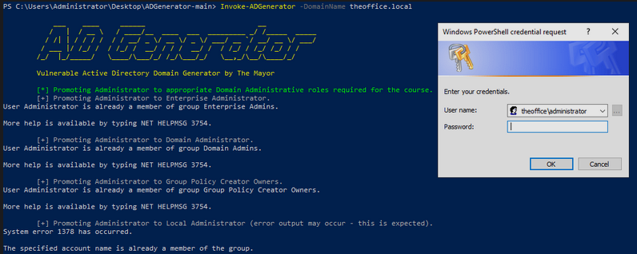

# Change DC01 Network Settings:

Please follow these steps to change the Domain Network to a NAT Network:

- Select the virtual machine named DC01.
    
- Click on "Settings" to access the VM settings.
    
- Navigate to the "Network" section.
    
- Under the "Attached to" option, select "NAT Network" from the dropdown menu.
    
- Next, choose the "Secure" network name from the available options.

By following these steps, you will effectively configure the DC01 virtual machine to use a NAT Network on Secure IP.

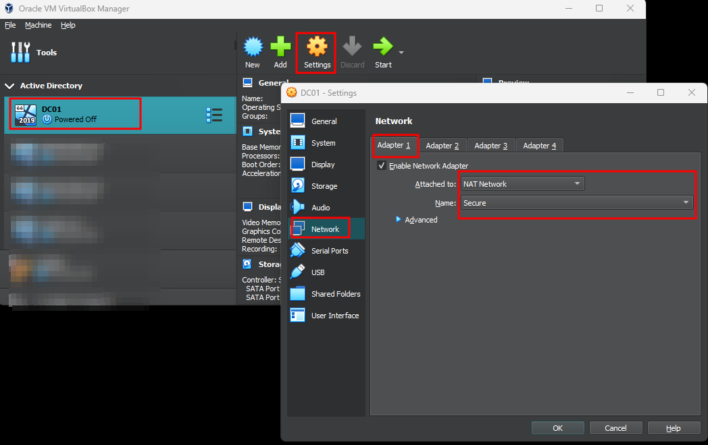

In summary, you have completed the setup of the Windows virtual machine, executed the required scripts, and made security-enhancing configuration changes. Remember to review scripts before running them for better understanding. By prioritizing security and following best practices, you can create a safe and reliable virtual environment for your needs.
