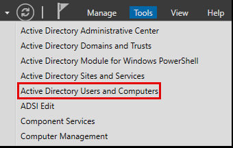

# Creating Virtual WorkStation 01,02:

> **Work-Station Required: Windows 10 pro**

This segment is designed to assist beginners in creating Windows virtual machines in a straightforward manner. If you already have experience with this process, you can skip ahead to.

Follow the identical steps mentioned earlier in the domain setup process to add a virtual machine.

## Setting up Machines:

- Select your preferred region


-  Choose a keyboard layout that suits your preferences


For this lab setup, let's choose the "Set up for personal use" option. This option is suitable for individual users who want to configure their virtual machine for personal use.


- During the setup process, you will be prompted to add your account. In the bottom left corner of the screen, select the option for creating an offline account. This will allow you to set up a local account on the virtual machine without requiring an internet connection.


- For the time being, let's choose the "Limited experience" option.


-  Provide a username for this PC.

### Credentials For both Work-Stations:
| Workstation | Username   | Password     |
|-------------|------------|--------------|
| 1           | s.chisholm | FallOutBoy1! |
| 2           | m.seitz | Phi11i35@44 |


- In the next step, you will need to choose three security questions. Please proceed to select the three security questions of your choice.


- For the privacy settings, you can proceed to disable all options as they are not necessary for your current requirements.


Once the above steps are completed, both workstations will require a moment to load and start up. This process may take a few moments as the virtual machines initialize and prepare for use. Please be patient while the workstations complete their startup process.

## Joining Domains: Step-by-Step Guide

To access the work or school settings, navigate to the Settings menu and click on "Accounts". From there, select "Access work or school" to proceed with the "Connect".


- In our scenario, we need to join a local Active Directory domain.


- In our case, we will join the local Active Directory domain named "mayorsec.local"


- You will be prompted to enter a user account and its corresponding password for authentication purposes.


- When prompted to input a user and their password, ensure that you choose the "Administrator" account. This account typically has the necessary permissions to join the domain and perform administrative tasks.


- After the virtual machine reboots, you will notice that it is now successfully joined to the domain.


> **To join Workstation2 to the domain, repeat the same procedure as mentioned earlier.**

- If you navigate back to the server, open Server Manager, and click on "Tools" at the top right corner of the window. From the dropdown menu, select "Active Directory Users and Computers" to launch the management console for managing Active Directory user accounts and organizational units.



- By clicking on the "Computers" tab in the Active Directory Users and Computers management console, you should be able to locate both Workstation1 and Workstation2 listed as computer objects within the domain.


- To improve the identification of the computers, you can utilize the nameGen script to automatically rename both Workstation1 and Workstation2.


-  Access the "Shared" folder among the three available folders. This folder typically contains resources or objects that are shared within the network or domain.


- If you continue navigating further within the "Shared" folder, you should be able to locate the nameGen script. Explore the subfolders or directories within the "Shared" folder to find the specific location of the nameGen script.


-  Open a PowerShell console as an administrator.

```powershell
PS C:\Users\s.chisholm.mayorsec\Desktop> dir


    Directory: C:\Users\s.chisholm.mayorsec\Desktop


Mode                 LastWriteTime         Length Name
----                 -------------         ------ ----
-a----         7/14/2023   2:10 AM            951 nameGen.ps1


PS C:\Users\s.chisholm.mayorsec\Desktop> Set-ExecutionPolicy Unrestricted

Execution Policy Change
The execution policy helps protect you from scripts that you do not trust. Changing the execution policy might expose you to the security risks described in the about_Execution_Policies help topic at
https:/go.microsoft.com/fwlink/?LinkID=135170. Do you want to change the execution policy?
[Y] Yes  [A] Yes to All  [N] No  [L] No to All  [S] Suspend  [?] Help (default is "N"): Y
PS C:\Users\s.chisholm.mayorsec\Desktop> . .\nameGen.ps1
PS C:\Users\s.chisholm.mayorsec\Desktop> executeScript -ComputerName WORKSTATION-02
WARNING: The changes will take effect after you restart the computer DESKTOP-C4EGH78.


    Directory: C:\


Mode                 LastWriteTime         Length Name
----                 -------------         ------ ----
d-----          14/7/2023  3:15 AM                Shared
AvailabilityType      : NonClustered
CachingMode           : Manual
CATimeout             : 0
ConcurrentUserLimit   : 0
ContinuouslyAvailable : False
CurrentUsers          : 0
Description           :
EncryptData           : False
FolderEnumerationMode : Unrestricted
IdentityRemoting      : False
Infrastructure        : False
LeasingMode           : Full
Name                  : Shared
Path                  : C:\Shared
Scoped                : False
ScopeName             : *
SecurityDescriptor    : O:SYG:SYD:(A;;FA;;;BU)
ShadowCopy            : False
ShareState            : Online
ShareType             : FileSystemDirectory
SmbInstance           : Default
Special               : False
Temporary             : False
Volume                : \\?\Volume{dc62328a-0000-0000-0000-300300000000}\
PSComputerName        :
PresetPathAcl         : System.Security.AccessControl.DirectorySecurity
```
- Again, clicking on the "Computers" tab in the Active Directory Users and Computers management console, you should be able to locate both Workstation1 and Workstation2 has been renamed as computer objects within the domain.


## Change WorkStation 01,02 Network Settings:

### Workstation 01:

Here is a table displaying the network adapter configuration for Workstation 01:

| Adapter   | Network Type   | Network Setting |
|-----------|----------------|-----------------|
| Adapter 1 | NAT Network    | External        |
| Adapter 2 | NAT Network    | Internal        |
| Adapter 3 | NAT Network    | Secure          |

By configuring the network adapters in this manner, Adapter 1 is set to use the NAT Network in External mode, Adapter 2 uses NAT Network in Internal mode, and Adapter 3 is configured to utilize the NAT Network in Secure mode.


### Workstation 02:

Here is a table reflecting the network adapter configuration for Workstation 01:

| Adapter   | Network Type   | Network Setting |
|-----------|----------------|-----------------|
| Adapter 1 | NAT Network    | Internal        |
| Adapter 2 | NAT Network    | Secure          |

In this configuration, Adapter 1 is enabled and set to use the NAT Network in Internal mode, while Adapter 2 is also enabled and configured to utilize the NAT Network in Secure mode.


In conclusion, you have successfully completed the necessary steps to join both Workstation 01 and Workstation 02 to the domain, configured network adapters, and made additional configurations as required. You have also explored the Active Directory Users and Computers management console and located the nameGen script within the "Shared" folder. By following these steps, you have established a functional and secure environment for your lab exercises. Keep exploring and learning to make the most out of your virtual domain setup.
